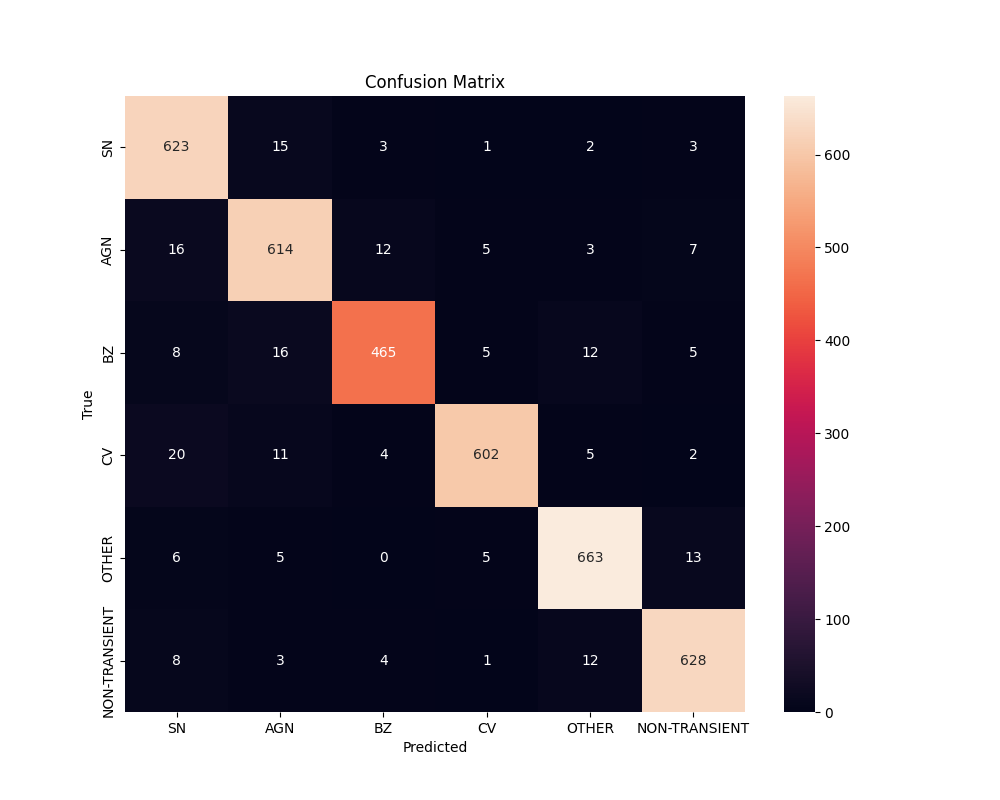
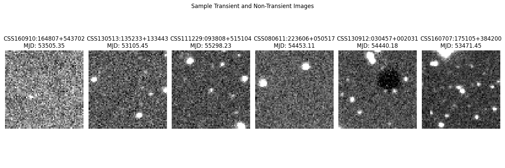

# DEEP-TAO Replication: Classifying Astronomical Transients with Deep Learning

This project replicates the DEEP-TAO study  to classify transient astronomical events using a convolutional neural network (CNN). The dataset, sourced from [MachineLearningUniande](https://github.com/MachineLearningUniande), contains FITS images of transient (e.g., supernovae, active galactic nuclei) and non-transient astronomical objects. Due to computational constraints, we used a subset of ~2,000 FITS files (~17,136 images) to train a baseline CNN, achieving an average F1-score of 0.9438, surpassing the original study's TAO-Net (F1=0.5458).

## Project Overview
- **Objective**: Replicate the DEEP-TAO study to classify six astronomical classes (SN, AGN, BZ, CV, OTHER, NON-TRANSIENT) using deep learning.
- **Methodology**: Trained a CNN with 3 convolutional layers (32, 64, 128 filters), max pooling, dropout (0.5), and softmax output, using TensorFlow 2.19.0 on a CPU-only setup.
- **Results**: Achieved F1-scores of 0.9296–0.9559 (average 0.9438), with visualizations including a confusion matrix and sample FITS images.
- **Key Insight**: Demonstrated the power of deep learning for astronomical image classification, even with limited resources, though results suggest overfitting due to the small dataset.

## Repository Structure
- `data/`: Placeholder for DEEP-TAO dataset (download from [MachineLearningUniande](https://github.com/MachineLearningUniande)).
- `results/`: Contains model outputs (confusion matrix, sample images, F1-scores, saved model).
- `scripts/`: Core scripts (`replicate_deep_tao.py` for training, `testModel.py` for model verification).
- `requirements.txt`: Dependencies for running the project.

## Setup Instructions
1. **Clone the Repository**:
   git clone https://github.com/DreadPirateSamuel/Deep-TAO-Replication.git
   cd Deep-TAO-Replication

2. Create a Virtual Environment (venv):
   python -m venv .astro
   source .astro/bin/activate  # Linux/Mac
   .astro\Scripts\activate     # Windows

3. Install Dependencies
pip install -r requirements.txt

4. Download the dataset. Obtain the DEEP-TAO dataset from [MachineLearningUniande](https://github.com/MachineLearningUniande). Place MANTRA-master, TAO_non-transients-master, and TAO_transients-master in the data/ folder.

5. Run the code.
python scripts/replicate_deep_tao.py
Outputs (e.g., confusion_matrix.png, sample_images.png) will be saved in results/. Verify the model with:
python scripts/testModel.py

Results
F1-Scores:
SN: 0.9383
AGN: 0.9296
BZ: 0.9309
CV: 0.9533
OTHER: 0.9546
NON-TRANSIENT: 0.9559
Average: 0.9438

Visualizations:
Confusion Matrix: Shows strong classification with minimal misclassifications.
Sample Images: Displays one FITS image per class with CRTS_ID and MJD annotations.

